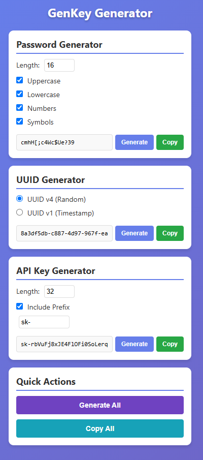

# 🔑 GenKey - Chrome Extension

<div align="center">


[](chrome://extensions/)
[](https://github.com/kianbabai/GenKey/releases)
[](https://github.com/kianbabai/GenKey/stargazers)
[](https://github.com/kianbabai/GenKey/network)
[](https://github.com/kianbabai/GenKey/issues)
[](https://github.com/kianbabai/GenKey/blob/main/LICENSE)

**A powerful and secure Chrome extension for generating passwords, UUIDs, and API keys with customizable options.**

[Installation](#-installation) • [Features](#-features) • [Screenshots](#-screenshots) • [Usage](#-usage) • [Contributing](#-contributing)

</div>

---

## ✨ Features

<table>
<tr>
<td width="50%">

### 🔐 Password Generator
- **Customizable length** (4-128 characters)
- **Character set options**:
  - Uppercase letters (A-Z)
  - Lowercase letters (a-z)
  - Numbers (0-9)
  - Special symbols (!@#$%^&*)
- **One-click generation**
- **Copy to clipboard**

</td>
<td width="50%">

### 🆔 UUID Generator
- **UUID v4** (Random-based)
- **UUID v1** (Timestamp-based)
- **Standard format** (xxxxxxxx-xxxx-4xxx-yxxx-xxxxxxxxxxxx)
- **Instant generation**
- **Copy functionality**

</td>
</tr>
<tr>
<td width="50%">

### 🔑 API Key Generator
- **Configurable length** (8-128 characters)
- **Optional prefix** (e.g., sk-, pk-, api-)
- **Alphanumeric characters**
- **Secure random generation**
- **Easy copying**

</td>
<td width="50%">

### ⚡ Quick Actions
- **Generate All** - Create all types at once
- **Copy All** - Copy everything to clipboard
- **Modern UI** with smooth animations
- **Responsive design**

</td>
</tr>
</table>

## 🚀 Installation

### Method 1: Load Unpacked (Recommended)

1. **Download the extension**
   ```bash
   git clone https://github.com/kianbabai/GenKey.git
   cd GenKey
   ```

2. **Open Chrome Extensions**
   - Navigate to `chrome://extensions/`
   - Enable "Developer mode" (toggle in top-right)

3. **Load the extension**
   - Click "Load unpacked"
   - Select the `GenKey` folder
   - The GenKey icon will appear in your toolbar

### Method 2: Chrome Web Store
*Coming soon...*

## 📸 Screenshots

<div align="center">

### GenKey Extension Interface



*The main GenKey extension popup showing all generators in action*

</div>

## 🎯 Usage

### Quick Start
1. Click the GenKey icon in your Chrome toolbar
2. Configure your preferences
3. Click "Generate" to create new values
4. Use "Copy" to copy individual items or "Copy All" for everything

### Detailed Usage

#### Password Generation
- Set desired length (4-128 characters)
- Choose character types (uppercase, lowercase, numbers, symbols)
- Click "Generate" to create a new password
- Use "Copy" to copy to clipboard

#### UUID Generation
- Select UUID type (v4 for random, v1 for timestamp-based)
- Click "Generate" to create a new UUID
- Use "Copy" to copy to clipboard

#### API Key Generation
- Set desired length (8-128 characters)
- Optionally add a prefix (e.g., sk-, pk-)
- Click "Generate" to create a new API key
- Use "Copy" to copy to clipboard

## 🛠️ Development

### Project Structure
```
GenKey/
├── 📁 icons/                 # Extension icons
│   ├── icon16.png           # 16x16 icon
│   ├── icon48.png           # 48x48 icon
│   └── icon128.png          # 128x128 icon
├── 📁 screenshots/           # Documentation screenshots
├── 📄 manifest.json         # Extension manifest
├── 📄 popup.html            # Main popup interface
├── 📄 popup.js              # Core functionality
├── 📄 popup.css             # Styling
├── 📄 README.md             # This file
├── 📄 LICENSE               # MIT License
└── 📄 CONTRIBUTING.md       # Contribution guidelines
```

### Building
No build process required - just load the extension directly in Chrome.

### Testing
1. Load the extension in Chrome
2. Test all generation functions
3. Verify copy functionality
4. Check responsive design

## 🤝 Contributing

We welcome contributions! Please see our [Contributing Guidelines](CONTRIBUTING.md) for details.

### How to Contribute
1. Fork the repository
2. Create a feature branch (`git checkout -b feature/amazing-feature`)
3. Commit your changes (`git commit -m 'Add amazing feature'`)
4. Push to the branch (`git push origin feature/amazing-feature`)
5. Open a Pull Request

### Development Setup
```bash
# Clone the repository
git clone https://github.com/kianbabai/GenKey.git

# Navigate to the project
cd GenKey

# Load in Chrome (Developer mode)
# Go to chrome://extensions/ and load unpacked
```

## 📊 Statistics

<div align="center">


</div>

## 📝 Changelog

### [v1.0.0] - 2024-12-19

#### Added
- 🔐 Password generator with customizable options
- 🆔 UUID generator (v4 and v1)
- 🔑 API key generator with prefix support
- ⚡ Quick actions (Generate All, Copy All)
- 🎨 Modern UI with smooth animations
- 📋 Copy to clipboard functionality
- 📱 Responsive design

#### Technical
- Manifest V3 compliance
- No external dependencies
- Lightweight and fast
- Cross-platform compatibility

## 📄 License

This project is licensed under the MIT License - see the [LICENSE](LICENSE) file for details.

## 🙏 Acknowledgments

- Chrome Extension API documentation
- Community feedback and suggestions
- Open source contributors

## 📞 Support

- 🐛 **Bug Reports**: [GitHub Issues](https://github.com/kianbabai/GenKey/issues)
- 💡 **Feature Requests**: [GitHub Discussions](https://github.com/kianbabai/GenKey/discussions)
- 📧 **Contact**: [kianbabai@github.com](mailto:kianbabai@github.com)

## 🌟 Show Your Support

If you find this extension useful, please give it a ⭐ on GitHub!

---

<div align="center">

**Made with ❤️ by [Kian Babai](https://github.com/kianbabai)**

[](https://github.com/kianbabai)
[](https://linkedin.com/in/kianbabai)
[](https://twitter.com/kianbabai)

</div>
